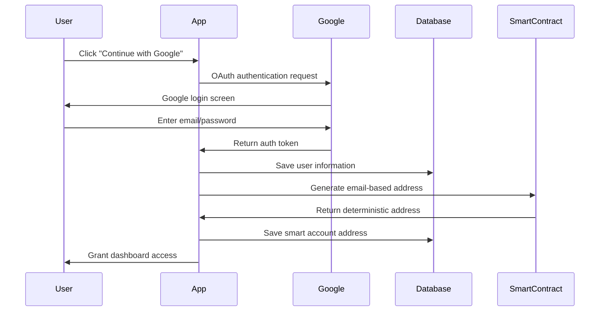
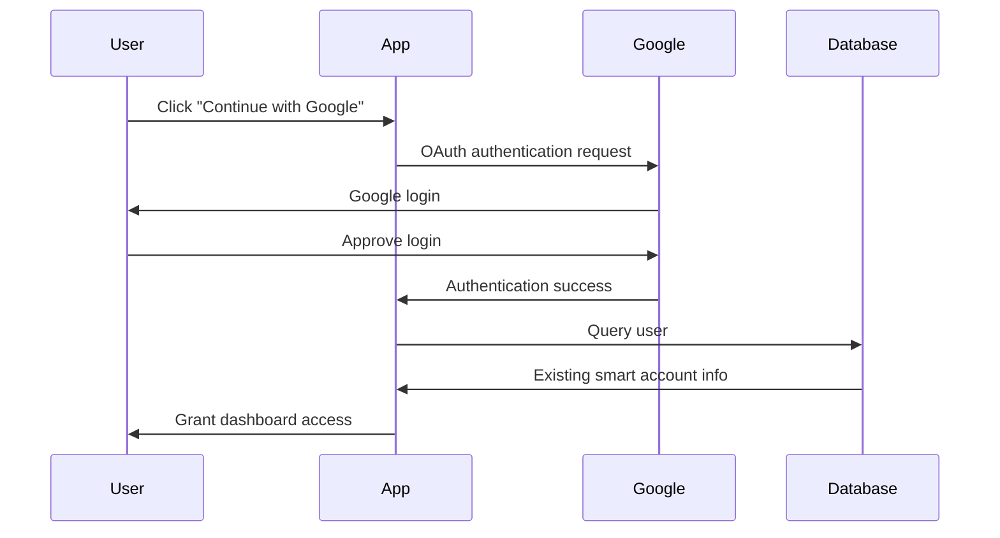
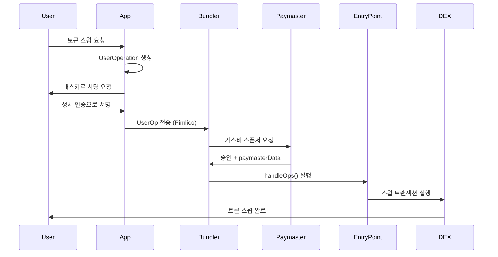

# OneClick DeFi

**Email to DeFi in One Click** - Start DeFi with just your email. No wallet setup, no gas fees, no complexity.


## 🌟 Project Overview

OneClick DeFi completely removes Web3 entry barriers. Trade tokens across 60+ blockchains using only your email address and biometric authentication (Face ID, Touch ID, Windows Hello).

### 🎯 Core Features

- **🔐 Passkey Authentication**: Simple login with biometric authentication
- **💸 Zero Gas Fees**: All transaction fees are automatically sponsored
- **🌐 Multi-chain Support**: Access 60+ chains through OKX DEX
- **📧 Email-based**: Use email instead of complex wallet addresses
- **🎨 Modern UI/UX**: 3D effects and dark mode support
- **⚡ One-click Swaps**: Instant trading without complex processes

## 🚀 Quick Start

### Prerequisites

- Node.js 18 or higher
- Modern browser with biometric authentication support
- Windows/macOS/Linux

### Installation & Setup

1. **Clone the project**
```bash
git clone https://github.com/yourusername/oneclick-defi.git
cd oneclick-defi
```

2. **Install dependencies**
```bash
npm install
```

3. **Setup environment variables**
```bash
cp .env.example .env.local
```

Open the `.env.local` file and configure the following values:
```env
# OKX DEX API (Get from https://www.okx.com/web3/build/docs/dex)
OKX_API_KEY=your_api_key
OKX_SECRET_KEY=your_secret_key
OKX_PASSPHRASE=your_passphrase

# Pimlico Bundler (Get from https://pimlico.io)
NEXT_PUBLIC_PIMLICO_API_KEY=your_pimlico_key

# XLayer RPC
XLAYER_RPC_URL=https://rpc.xlayer.tech

# Google OAuth (Required! - See GOOGLE_AUTH_SETUP.md)
NEXTAUTH_URL=http://localhost:3500
NEXTAUTH_SECRET=your-32-character-secret
GOOGLE_CLIENT_ID=your-client-id.apps.googleusercontent.com
GOOGLE_CLIENT_SECRET=your-client-secret

# Database
DATABASE_URL="file:./dev.db"
```

4. **Initialize database**
```bash
npx prisma db push
```

5. **Run development server**
```bash
npm run dev
```

6. **Open in browser**
```
http://localhost:3500
```

## 🏗️ Tech Stack

### Frontend
- **Framework**: Next.js 14 (App Router)
- **Language**: TypeScript
- **Styling**: Tailwind CSS
- **3D Graphics**: Three.js
- **State Management**: React Hooks

### Blockchain
- **Network**: XLayer (OKB Chain)
- **Account Model**: ERC-4337 (Account Abstraction)
- **Web3 Library**: Viem
- **Bundler**: Pimlico
- **DEX**: OKX DEX Aggregator

### Authentication
- **WebAuthn API**: Passkey-based authentication
- **Signature**: P256 (secp256r1)

## 📁 Project Structure

```
oneclick-defi/
├── app/                    # Next.js app directory
│   ├── api/               # API routes
│   ├── page.tsx           # Landing page
│   └── globals.css        # Global styles
├── components/            # React components
│   ├── Dashboard.tsx      # Main dashboard
│   ├── EmailSignup.tsx    # Email signup
│   ├── SwapInterface.tsx  # Token swap UI
│   └── PolygonGlobe.tsx   # 3D background effect
├── contracts/             # Smart contracts
│   ├── OneClickAccount.sol
│   ├── OneClickFactory.sol
│   └── SessionKeyModule.sol
├── lib/                   # Core libraries
│   ├── passkey.ts        # Passkey authentication
│   ├── smart-account/    # Smart account
│   ├── gasless/          # Gasless transactions
│   └── okx/              # OKX DEX integration
└── hooks/                # React hooks
```

## 💡 How It Works

### 1. Account Creation Flow (Google OAuth)


### 2. Re-login Flow


### 3. Gasless Transaction Execution (ERC-4337)


### 4. 핵심 구성 요소
- **Google OAuth**: 간편한 소셜 로그인
- **NextAuth.js**: 세션 관리 및 인증 처리
- **Prisma + SQLite**: 사용자 데이터 저장
- **스마트 계정**: 이메일로 결정되는 ERC-4337 계정
- **Factory**: CREATE2를 사용한 결정적 주소 생성
- **Bundler**: UserOperation을 번들링하여 온체인 전송
- **Paymaster**: 모든 가스비를 대신 지불

## 🎨 UI/UX 특징

- **모던 디자인**: 그라디언트와 글래스모피즘 효과
- **다크모드**: 시스템 설정 연동
- **3D 효과**: WebGL 기반 인터랙티브 배경
- **반응형**: 모바일/태블릿/데스크톱 지원
- **애니메이션**: 부드러운 전환 효과

## 🔧 개발자 가이드

### 스마트 컨트랙트 배포

1. **Hardhat 설정**
```bash
cd contracts
npm install
```

2. **XLayer 테스트넷 배포**
```bash
npm run deploy
```

3. **배포된 주소 확인**
```
contracts/deployed-addresses.json
```

### 주요 컴포넌트

#### EmailSignup
- 패스키 생성 및 등록
- 스마트 계정 생성
- 에러 처리 및 재시도

#### SwapInterface
- 토큰 선택 및 수량 입력
- 실시간 환율 조회
- 가스리스 스왑 실행

#### Dashboard
- 잔액 및 토큰 목록
- 거래 히스토리
- 포트폴리오 뷰

## 🚢 프로덕션 배포

### Vercel 배포
```bash
npm run build
vercel --prod
```

### 환경 변수 설정
Vercel 대시보드에서 다음 환경 변수 추가:
- `OKX_API_KEY`
- `OKX_SECRET_KEY`
- `OKX_PASSPHRASE`
- `NEXT_PUBLIC_PIMLICO_API_KEY`

## 🔒 보안 고려사항

- **Google OAuth**: Google의 보안 인프라 활용
- **세션 관리**: NextAuth.js의 안전한 세션 처리
- **데이터베이스**: SQLite로 로컬 데이터 보호
- **결정적 주소**: 이메일 기반 주소 생성으로 일관성 보장
- **스마트 컨트랙트**: 감사 예정
- **가스리스**: Paymaster 검증 로직
- **HTTPS 불필요**: localhost에서도 안전하게 작동

## 🐛 알려진 이슈

- iOS Safari에서 3D 효과 성능 저하
- 일부 구형 브라우저에서 패스키 미지원

## 🤝 기여하기

기여를 환영합니다! PR을 보내주세요.

## 📄 라이센스

MIT License

## 🙏 감사의 말

- **OKX Hackathon** 주최 측
- **XLayer** 팀의 기술 지원
- **Pimlico** 번들러 서비스

## 📞 연락처

- **Team**: HoloStudio
- **Developer**: [@holostudio](https://github.com/holostudio)

---

<p align="center">Built with ❤️ for OKX Hackathon 2024</p>